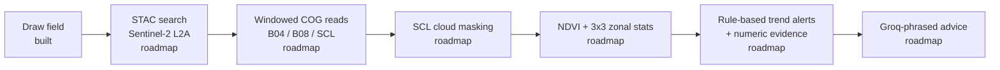

# TerraSight

**An early-warning system for crops that watches fields from space and flags stress before it's visible on the ground. Free satellite data. Zero hardware. ₹0 to run.**


---

## The 10-second pitch

Crop stress — water shortage, nutrient deficiency, early disease — is invisible
to the eye until it is expensive. By the time a field looks sick from the field
bund, the yield is often already lost.

Sentinel-2 satellites revisit every field on Earth roughly every five days, for
free. Stressed plants reflect near-infrared light differently weeks before they
look sick to a human. TerraSight reads that signal and turns it into a plain
warning.

**Watch** fields from orbit → **Warn** when a zone's health declines against its
own history → **Advise** in plain language, always showing the numbers behind
the call.

---

## Demo

<!--
  RECORD THIS before sharing the repo — it sells TerraSight more than any prose.
  Capture one continuous loop, ~15s:
    1. Draw a field polygon on the satellite map
    2. NDVI health overlay renders (green->brown)
    3. A zone alert appears ("NW zone down 14%")
    4. Plain-language advice with its evidence expands
  Save as docs/demo.gif and replace the placeholder below.
-->

> _Demo GIF coming with Phase 6. Today the loop covers draw → validate → save →
> reload; the health overlay, alerts, and advice arrive in Phases 2–6._

```
[ draw field ] → [ NDVI health map ] → [ zone alert ] → [ advice + evidence ]
```

---

## How it works

> This is the **target architecture**. Stages are marked ✅ built or ◻ roadmap.



**Draw field** ✅ — A polygon is validated server-side (valid rings, closure, no
self-intersection) and measured by reprojecting to its local UTM zone; fields
outside 0.5–500 ha are rejected with a readable reason.

**STAC search** ◻ — Query Earth Search (Element84) for recent low-cloud
Sentinel-2 scenes intersecting the field.

**Windowed COG reads** ◻ — Read only the field's window from the Cloud-Optimized
GeoTIFFs on AWS via HTTP range requests — **kilobytes fetched per field, not
gigabytes.** No scene downloads, no imagery stored.

**SCL cloud masking** ◻ — Drop cloud, shadow, and cirrus pixels using the scene
classification band. A date with under 60% valid pixels is discarded — NDVI is
never computed through cloud.

**NDVI + zonal stats** ◻ — Compute NDVI over the field and a 3×3 zone grid, so a
decline can be localized to "the north-west corner," not just "the field."

**Rule-based trend alerts** ◻ — Deterministic rules decide when a decline is
real; each alert carries its own numeric evidence (start/end NDVI, % change,
window).

**Groq-phrased advice** ◻ — The LLM only rewrites structured alerts into plain
language. It never originates an alert, so there is nothing to hallucinate.

The two decisions that make this interesting:

1. **Keyless, quota-free imagery.** Earth Search STAC + AWS COG range requests
   mean no API key, no rate limit, and kilobytes per field instead of gigabytes.
2. **Rules decide, the LLM only phrases.** Every alert is generated by
   deterministic rules and shipped with its numbers. The model translates; it
   does not diagnose.

---

## The ₹0 stack

Every service sits inside a free tier or open-data programme.

| Layer | Service | Cost |
| --- | --- | --- |
| Satellite imagery | Sentinel-2 L2A via AWS Open Data + Earth Search STAC | ₹0 |
| Weather | Open-Meteo | ₹0 |
| Database / Auth / Storage | Supabase (free tier) | ₹0 |
| LLM inference | Groq (free tier) | ₹0 |
| Web hosting | Vercel | ₹0 |
| API hosting | Render | ₹0 |

---

## Honest limitations

These are design boundaries, chosen deliberately.

- **10 m resolution floor.** One Sentinel-2 pixel is 10 m across, so the smallest
  meaningful field is ~0.5 ha. TerraSight rejects anything smaller rather than
  pretend to see it.
- **Clouds interrupt.** During monsoon, weeks can pass with no clear pass. The
  product surfaces this directly — "last clear satellite pass: N days ago" — and
  never invents data for a clouded date.
- **NDVI shows stress, not cause.** A decline flags *that* something is wrong,
  not *why*. Advice hedges causes and points the farmer to check on foot. It is
  an advisory tool, not a diagnosis, and never recommends chemicals or dosages.

---

## Quickstart

Clone to a running app in one sitting.

### Prerequisites

- Node.js 20+ and Python 3.11
- A free [Supabase](https://supabase.com) project (PostGIS is enabled by the migration)
- A [Groq](https://console.groq.com) API key — optional, and only needed from Phase 5

### 1. Clone and configure environment

```bash
git clone https://github.com/sheshakanthra/Terra-Sight.git terrasight
cd terrasight
cp .env.example apps/api/.env         # fill in Supabase values
cp .env.example apps/web/.env.local   # fill in NEXT_PUBLIC_* values
```

Only `apps/api/.env` and `apps/web/.env.local` are read — a root `.env` is
ignored by both apps.

> ⚠️ **Save both files as UTF-8 without a BOM.** A BOM is folded into the first
> variable name and that setting is silently dropped. VS Code's default (UTF-8,
> no BOM) is correct.
>
> ⚠️ **`SUPABASE_URL` must be the project base URL** (`https://<ref>.supabase.co`),
> **not** the `/rest/v1/` endpoint — the client appends the path itself.

### 2. Set up the database

In the Supabase dashboard, open **SQL Editor → New query**, paste the contents
of [`supabase/migrations/0001_fields.sql`](supabase/migrations/0001_fields.sql),
and run it. It enables PostGIS, creates the `fields` table with row-level
security, and is safe to re-run.

### 3. Run the API

```bash
cd apps/api
python -m venv .venv
.venv/Scripts/activate          # Windows; use: source .venv/bin/activate elsewhere
pip install -r requirements-dev.txt
uvicorn app.main:app --reload --port 8000
```

### 4. Run the web app

```bash
# from the repository root
npm install
npm run dev
```

Web on <http://localhost:3000>, API on <http://localhost:8000>
(<http://localhost:8000/docs> for the OpenAPI browser). Sign in with your email,
draw a field over real cropland, and watch it save and reload.

---

## Project structure

```
terrasight/
├── apps/
│   ├── web/                  Next.js 15 · TypeScript · Tailwind
│   │   └── src/
│   │       ├── app/          Routes and auth-gated entry point
│   │       ├── components/   Map (MapLibre + terra-draw), sign-in, workspace
│   │       └── lib/          Supabase client, typed API client
│   └── api/                  FastAPI · Python 3.11
│       ├── app/
│       │   ├── routers/      /health, /fields
│       │   ├── geometry.py   Validation + UTM area measurement
│       │   ├── auth.py       JWT verification via Supabase Auth
│       │   └── config.py     Typed, env-only settings
│       └── tests/            Pytest — geometry, config, fields
├── supabase/migrations/      SQL migrations
└── docs/                     Build state, progress reports, backlog
```

---

## Roadmap

- [x] **Phase 0** — Monorepo scaffold, health check, typed config
- [x] **Phase 1** — Fields: draw, validate, measure, save, reload (RLS-backed)
- [ ] **Phase 2** — Imagery pipeline: STAC search, windowed COG reads, SCL masking, NDVI + zonal stats
- [ ] **Phase 3** — Trend & alert engine (rule-based, evidence-carrying)
- [ ] **Phase 4** — Weather escalation via Open-Meteo
- [ ] **Phase 5** — Groq-phrased advisory with template fallback
- [ ] **Phase 6** — Dashboard: health overlay, zone grid, time series, advice
- [ ] **Phase 7** — Ship: Vercel + Render, daily refresh cron

Deliberately out of scope for v1:

- [ ] WhatsApp delivery of alerts and advice
- [ ] NDRE / EVI indices
- [ ] Multi-crop calendars
- [ ] Financial impact estimates
- [ ] Government scheme matching
- [ ] Historical yield correlation
- [ ] Mobile app

---

## License

Released under the [MIT License](LICENSE).

Built by **Sheshakanth** — [github.com/sheshakanthra](https://github.com/sheshakanthra)
