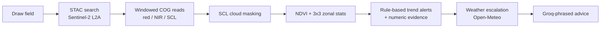

# TerraSight

**An early-warning system for crops that watches fields from space and flags stress before it's visible on the ground. Free satellite data. Zero hardware. ₹0 to run.**


---

## The 10-second pitch

Crop stress — water shortage, nutrient deficiency, early disease — is invisible
to the eye until it is expensive. By the time a field looks sick from the bund,
the yield is often already lost.

Sentinel-2 satellites revisit every field on Earth roughly every five days, for
free. Stressed plants reflect near-infrared light differently weeks before they
look sick to a human. TerraSight reads that signal and turns it into a plain
warning.

**Watch** fields from orbit → **Warn** when a zone's health declines against its
own history → **Advise** in plain language, always showing the numbers behind
the call.

---

## Demo

<!--
  RECORD THIS before sharing the repo — it sells TerraSight more than any prose.
  One continuous ~15s loop: draw a field → refresh → NDVI health overlay renders
  → a zone shows a stress arrow → advice expands with its evidence.
  Save as docs/demo.gif and replace the placeholder below.
-->


> The dashboard: a georeferenced NDVI health overlay, a 3×3 zone health matrix,
> the NDVI trend, rainfall, and a ranked action list that cites its evidence —
> "the east and south-east zones declined 29% over 38 days; a dry week is
> forecast; check on foot."

---

## How it works



**Draw** a field; its geometry is validated server-side and measured in its
local UTM zone.

**Read** only the field's window from the Cloud-Optimized GeoTIFFs on AWS via
HTTP range requests — **kilobytes per field, not gigabytes.** No scene
downloads, no imagery stored.

**Mask** cloud, shadow, and cirrus with the scene classification band; a date
under 60% valid pixels is discarded. NDVI is never computed through cloud.

**Measure** NDVI over the field and a 3×3 zone grid, so a decline is localized
to "the north-west corner," not just "the field."

**Alert** with deterministic rules — a ≥10% relative decline that is currently
below the field's own median — each carrying its numeric evidence. A dry 7-day
forecast escalates severity and tags likely water stress.

**Advise** by handing those structured alerts to Groq, which only rephrases them
into plain language. A deterministic template is the fallback, so the product
works with no LLM at all.

The two decisions that make this interesting:

1. **Keyless, quota-free imagery.** Earth Search STAC + AWS COG range requests —
   no API key, no rate limit, kilobytes per field.
2. **Rules decide, the LLM only phrases.** Every alert is generated by
   deterministic rules and shipped with its numbers. The model translates; it
   does not diagnose, and it is validated so it can never name a chemical or a
   dose.

---

## The ₹0 stack

Every service sits inside a free tier or open-data programme.

| Layer | Service | Cost |
| --- | --- | --- |
| Satellite imagery | Sentinel-2 L2A via AWS Open Data + Earth Search STAC | ₹0 |
| Weather | Open-Meteo | ₹0 |
| Database / Auth / Storage | Supabase (free tier) | ₹0 |
| LLM inference | Groq (free tier) | ₹0 |
| Web hosting | Vercel | ₹0 |
| API hosting | Render | ₹0 |

---

## Honest limitations

These are design boundaries, chosen deliberately.

- **10 m resolution floor.** One Sentinel-2 pixel is 10 m across, so the smallest
  meaningful field is ~0.5 ha. TerraSight rejects anything smaller rather than
  pretend to see it.
- **Clouds interrupt.** During monsoon, weeks can pass with no clear pass. The
  dashboard says so directly — "last clear pass: N days ago" — and never invents
  data for a clouded date.
- **NDVI shows stress, not cause.** A decline flags *that* something is wrong,
  not *why*. Advice hedges causes, points the farmer to check on foot, and never
  recommends chemicals or dosages. It is an advisory tool, not a diagnosis.

---

## Architecture

```
terrasight/
├── apps/
│   ├── web/                  Next.js 15 · TypeScript · Tailwind · MapLibre · Recharts
│   │   └── src/
│   │       ├── app/          Auth-gated entry point
│   │       ├── components/   Map, sign-in, workspace, dashboard/
│   │       └── lib/          Supabase + typed API client, NDVI/zone helpers
│   └── api/                  FastAPI · Python 3.11 (Docker)
│       ├── app/
│       │   ├── imagery/      STAC, windowed COG reads, NDVI, zonal stats, PNG
│       │   ├── alerts/       Deterministic trend engine + persistence
│       │   ├── weather/      Open-Meteo + dry-forecast escalation
│       │   ├── advisory/     Template + Groq phrasing + safety validator
│       │   └── routers/      /health, /fields, /internal (cron)
│       ├── Dockerfile        GDAL/rasterio wheels — why the API is containerised
│       └── tests/            150 tests
├── supabase/migrations/      SQL: fields, observations, alerts, bounds
└── docs/                     Build state, progress reports, backlog
```

## Running locally

**Prerequisites:** Node 20+, Python 3.11, a [Supabase](https://supabase.com)
project (PostGIS is enabled by the migrations), and optionally a
[Groq](https://console.groq.com) key.

```bash
git clone https://github.com/sheshakanthra/Terra-Sight.git terrasight
cd terrasight
cp .env.example apps/api/.env         # fill in Supabase (and Groq) values
cp .env.example apps/web/.env.local   # fill in NEXT_PUBLIC_* values
```

> ⚠️ Save both env files as UTF-8 **without a BOM**, and set `SUPABASE_URL` to
> the project base URL (`https://<ref>.supabase.co`), not the `/rest/v1/`
> endpoint.

Apply the migrations in order (Supabase SQL Editor → New query):
`supabase/migrations/0001` … `0004`.

**API:**

```bash
cd apps/api
python -m venv .venv
.venv/Scripts/activate          # Windows; source .venv/bin/activate elsewhere
pip install -r requirements-dev.txt
uvicorn app.main:app --reload --port 8000
```

**Web** (from the repo root): `npm install && npm run dev`

Web on <http://localhost:3000>, API on <http://localhost:8000/docs>. Sign in,
draw a field over real cropland, refresh, and read its health.

## Checks

```bash
npm run typecheck && npm run lint && npm run build          # web
cd apps/api && ruff check . && mypy app && pytest           # api
```

## Deployment

- **Web → Vercel.** Import the repo, set the root directory to `apps/web`, and
  add the `NEXT_PUBLIC_*` env vars.
- **API → Render.** The [`render.yaml`](render.yaml) blueprint builds
  [`apps/api/Dockerfile`](apps/api/Dockerfile) and provisions a daily cron that
  refreshes every field via a secret-guarded `/internal/refresh-all` endpoint.
  Set `WEB_ORIGIN` to the deployed web origin, plus the Supabase and Groq
  secrets.

The GDAL/rasterio wheels are why the API is containerised rather than run as a
serverless function.

---

## License

Released under the [MIT License](LICENSE).

Built by **Sheshakanth** — [github.com/sheshakanthra](https://github.com/sheshakanthra)
